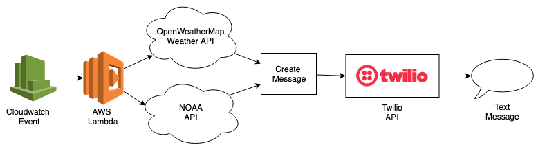

# weather-text

This project uses an AWS Lambda function to fetch current weather data, store it in a MySQL RDS database, and send a detailed weather forecast email via Amazon SES using Nodemailer.

Here's the process flow:



1. Lambda is triggered on a schedule by a CloudWatch/EventBridge rule.  
2. Lambda calls the OpenWeatherMap API for current conditions.  
3. Lambda calls the NOAA API for forecast data (weekly and hourly).  
4. Lambda saves the processed weather data into a MySQL RDS instance.  
5. Lambda constructs and sends a personalized forecast email via Amazon SES.

## Prerequisites

- **AWS Account & CLI**: Set up an AWS account and install/configure the AWS CLI.  
- **Node.js & npm**: Install Node.js (v14+) and npm on your local machine.  
- **ClaudiaJS CLI**: Install globally with:
  ```bash
  npm install -g claudia
  ```
- **MySQL RDS Instance**: Create a MySQL RDS database and configure security groups to allow Lambda access on port 3306.  
- **SES Setup**: Verify sender and recipient emails in Amazon SES.

## Environment Variables

Store sensitive values in a local `.env` file (and in your Lambda configuration) with the following keys:

```ini
# Weather APIs
OPEN_WEATHER_MAP_API_KEY=<Your_OpenWeatherMap_API_Key>
LATITUDE=<Latitude>
LONGITUDE=<Longitude>

# Email (SES)
SENDER_EMAIL=<Verified_SES_Sender_Email>
RECIPIENT_EMAIL=<Verified_SES_Recipient_Email>

# MySQL RDS
DB_HOST=<RDS_Endpoint>
DB_USER=<DB_Username>
DB_PASSWORD=<DB_Password>
DB_NAME=<Database_Name>
DB_PORT=3306
```

Ensure your `.gitignore` includes these entries:
```
.env
node_modules/
```

## NPM Scripts

In `package.json`, the following scripts simplify deployment and testing:

- **create-lambda**: Deploys a new Lambda:
  ```bash
  npm run create-lambda
  ```
- **update-lambda**: Updates environment variables on an existing Lambda:
  ```bash
  npm run update-lambda
  ```
- **local-test**: Invokes the Lambda locally via ClaudiaJS:
  ```bash
  npm run local-test
  ```

## Setup & Run Locally

1. **Install dependencies**:
   ```bash
   npm install
   ```
2. **Configure `.env`** with your values.  
3. **Create Lambda** (first time only):
   ```bash
   npm run create-lambda
   ```
4. **Deploy updates** after code changes:
   ```bash
   npm run update-lambda
   ```
5. **Test locally**:
   ```bash
   npm run local-test
   ```

## Scheduling

A CloudWatch/EventBridge rule triggers this Lambda on your desired cron schedule (e.g., daily at 8:00 AM PST), ensuring automatic daily weather updates.

## Monitoring & Logs

- **CloudWatch Logs**: View logs under `/aws/lambda/weather-text` for detailed execution traces.  
- **CloudWatch Alarms**: (Optional) Configure alarms on errors or high execution duration.

## Contributing

Feel free to open issues or pull requests. For major changes, please discuss them first via GitHub issues.

---
*Originally based on a project by @andrewevans0102, adapted by Derek Wen.*